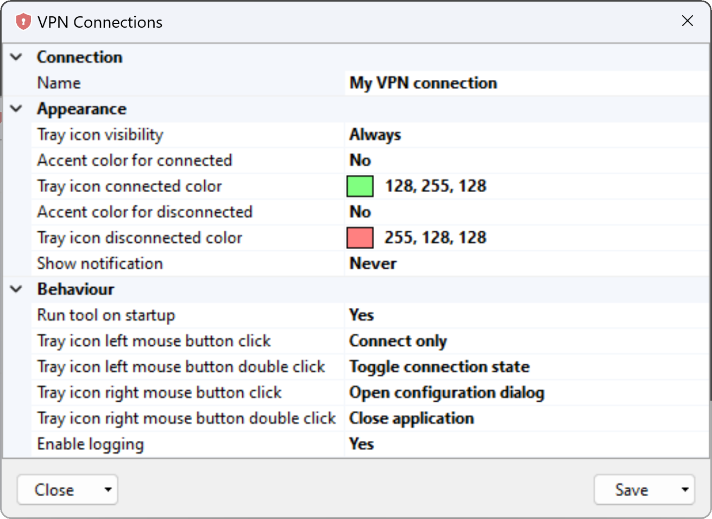
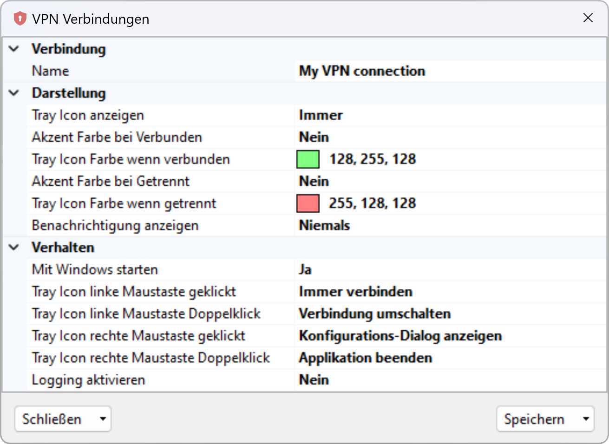

# VPN Connections
A little helper tool that shows the current state of the selected VPN connection as tray icon.

Additionally you can configure the appearance and behaviour of the tray icon:

The tool is customizable and you can configure the following settings:
- The name of the connection that should be tracked.
- When the icon should be shown. This can be never, always or only when connected or disconnected.
- The color of the tray icon in connected or disconnected stated. The color can either be manually configured or take the current accent color.
- If a notification message should be shown either never, when the state changed or when connected or disconnected.
- Decide if the tool should be run at startup of windows or not.
- What should happen if you click or double click with the left or right mouse button on the icon. Should the configuration dialog be opened, explicit connected or disconnected, change the connection state or close this application.

Additionally the tool has three command line arguments:
- `-show` will on startup automatically show the configuration dialog.
- `-culture` let you define the current language of the tool. English will be taken by default or if the desired language is not available. Currently additionally available is German only.
- `-log` creates a logfile in `%AppData%\VpnConnections`. Additionally a filter can be defined as comma separated values (eg. `VpnConnection, RasDial`). Possible values are:
    - TrayApplicationContext
    - ConfigurationDialog 
    - VpnConnection
    - RasDial
    - Autostart.CurrentUser
    - CommandLine
    - Cultures
    - Localize
    - Multiple.Try
    - Timer 

